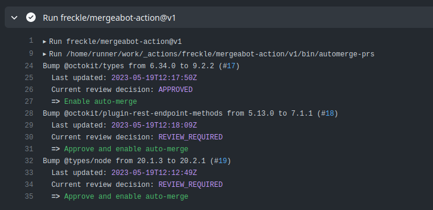
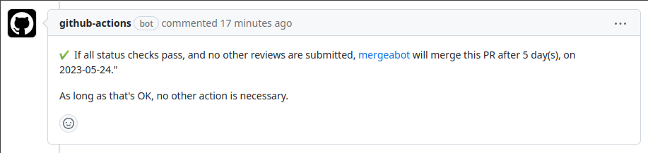

# Mergeabot

Auto-merge Dependabot PRs, only after a certain number of days have passed.

## Motivation

Using out of date dependencies is a Software Supply Chain risk, as
security-related patches may not be applied in a timely fashion.

Dependabot and timely merges of its PRs is a solution to this. Requiring manual
approval and merge of such PRs is typically busy work. With robust CI and QA
processes, such PRs should be a "merge on Green" scenario for your team. Any
process of an Engineer taking an action without thought should be automated.

Immediately merging new versions of dependencies is _also_ a Software Supply
Chain risk, as so-far-un-discovered exploits could exist in very new patches.

Automatically merging Dependabot PRs _only after some number of days_ (i.e.
after a "quarantine" period) is one mitigation for this, which this Action
implements.

## Events

Mergeabot's primary feature is to find Dependabot PRs that have been open for
your configured `quarantine-days` and merge them (technically, approve and
enable auto-merge so that status and review requirements are met):



### `schedule`

We recommend running this once a day, e.g. at midnight UTC, through the
`schedule` event:

```yaml
on:
  schedule:
    - cron: "0 0 * * *"
```

### `pull_request`

Our team uses `CODEOWNERS` and round-robins review-requests. This results in
folks being requested to review Dependabot PRs. This is unnecessary and
undesired; we want to leave these PRs to Mergeabot.

To ameliorate this, we run Mergeabot on `pull_request` events too:

```yaml
on:
  schedule:
    - cron: "0 0 * * *"

  pull_request:
    types: [opened]
```

Mergeabot knows if it's running on a `pull_request` event in a Dependabot PR
and, if so, leaves a comment on the PR indicating, roughly, "I got this."



## Permissions

Dependabot PRs use a token with read-only permissions by default, so you'll need
an explicit `permissions` key to use the above approach.

```yaml
permissions:
  contents: write
  pull-requests: write
```

**NOTE**: `contents:write` is required because Mergeabot will always do its
normal thing of finding other Dependabot PRs and handling them. This may be
surprising on PR events, but we find it useful. Patches welcome to make this
behavior optional.

## Complete Example

```yaml
name: Mergeabot

on:
  schedule:
    - cron: "0 0 * * *"

  pull_request:
    types: [opened]

permissions:
  contents: write
  pull-requests: write

jobs:
  mergeabot:
    runs-on: ubuntu-latest
    steps:
      - uses: freckle/mergeabot-action@v3
```

<!-- action-docs-inputs action="action.yml" -->

## Inputs

| name                  | description                                                                                                                                                                                                             | required | default                          |
| --------------------- | ----------------------------------------------------------------------------------------------------------------------------------------------------------------------------------------------------------------------- | -------- | -------------------------------- |
| `exclude-title-regex` | <p>Exclude PRs whose titles match this regular expression</p>                                                                                                                                                           | `true`   | `""`                             |
| `quarantine-days`     | <p>How long PRs must have gone since their last update to qualify for auto-merge. Default is 5, Set to -1 to disable</p>                                                                                                | `true`   | `5`                              |
| `strategy`            | <p>How to merge PRs, must be one of merge, rebase, or squash</p>                                                                                                                                                        | `true`   | `rebase`                         |
| `remove-reviewers`    | <p>Remove any reviewers from bot PRs when they open?</p>                                                                                                                                                                | `true`   | `true`                           |
| `bot-authors`         | <p>Which PR authors to act on, one login per line. Not limited to bots -- any author login works. Defaults to Dependabot and Renovate. Set to a single-entry list (dependabot[bot]) to restrict to Dependabot only.</p> | `true`   | `dependabot[bot] renovate[bot] ` |
| `github-actor`        | <p>Override GitHub actor. This is mostly useful in testing.</p>                                                                                                                                                         | `true`   | `${{ github.actor }}`            |
| `github-repository`   | <p>Override GitHub repository, if necessary</p>                                                                                                                                                                         | `true`   | `${{ github.repository }}`       |
| `github-token`        | <p>Override GitHub token, if necessary</p>                                                                                                                                                                              | `true`   | `${{ github.token }}`            |
| `dry-run`             | <p>Set to true to print, but not perform, any actions</p>                                                                                                                                                               | `true`   | `false`                          |

<!-- action-docs-inputs action="action.yml" -->

### Notable Inputs

- `exclude-title-regex`: exclude PRs whose titles match this regular expression

  Dependabot PRs follow the format `Bump {dep} to {version} in /{path}`, so this
  can be used to exclude PRs of certain dependencies or in certain directories.

  Note that GitHub could change this format at any time. If this happens, you
  would have `{quarantine-days}` days to notice and update your setting if
  necessary.

- `quarantine-days`: how many days a PR must be open before it qualifies for
  auto-merge. Default is 5.

- `strategy`: how to perform the [auto-]merge. Must be `merge`, `rebase`, or
  `squash`. Default is `rebase`.
- `remove-reviewers`: remove any requested reviewers (if run on PRs). Default
  is `true`.
- `bot-authors`: which PR authors to act on, one login per line (not limited
  to bots). Default is `dependabot[bot]` and `renovate[bot]`. To restrict to
  Dependabot only:

  ```yaml
  - uses: freckle/mergeabot-action@v3
    with:
      bot-authors: |
        dependabot[bot]
  ```

## Outputs

None.

## Caveats

This Action really only makes sense if Branch Protection is enabled, Approvals
are required, and Auto-merge is allowed. That's because it doesn't actually
merge PRs, it approves and enables auto-merge. That way, we can leave the
determination that all other PR requirements were satisfied to GitHub, where it
belongs.

## Development

This is a TypeScript Action. After changing anything in `src/`:

```console
pnpm install
pnpm test
pnpm run build   # rebuilds dist/index.js, which must be committed
```

CI fails if `dist/index.js` doesn't match what `src/` produces.

After changing anything in [`action.yml`](./action.yml), run `pnpm run readme`
to re-sync the Inputs table above. CI fails if it's out of date.

---

[LICENSE](./LICENSE)
